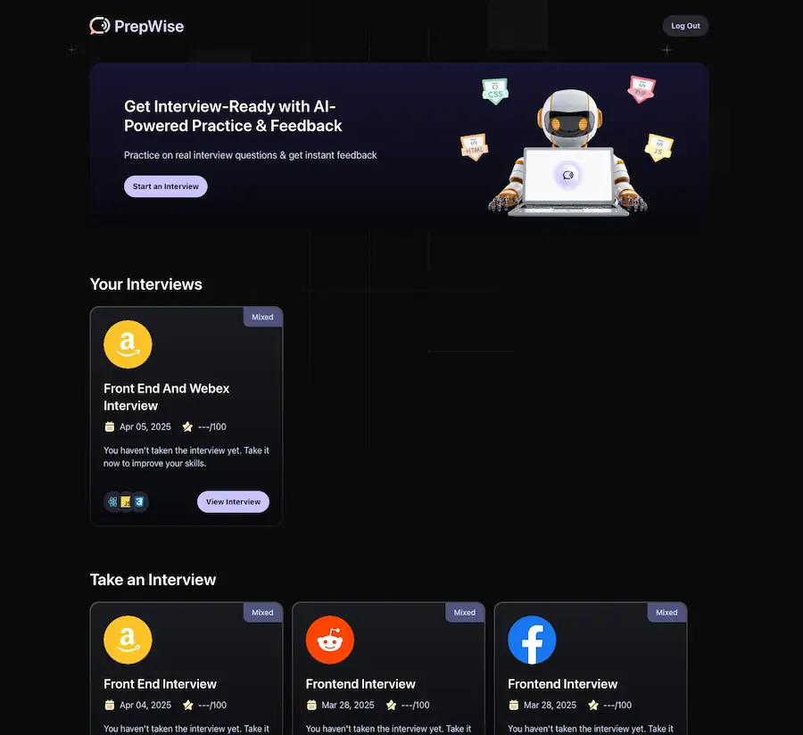

<h2>
    <em>PrepWise</em>, una app para practicar entrevistas de trabajo.
</h2>

Creado con <em>Next.js</em> y <em>Shadcn/ui</em>, usando tecnologias como Firebase y Vapi, junto la IA para crear una app 
en la que puedes practicar las entrevistas que tu mismo creas con un asistente, y luego recibir feedback de ellas para saber en que mejorar.

<strong><a href="https://ai-interview-nextjs-six.vercel.app/">LINK</a></strong>

</img>

## Stack

- [**Next.js**](https://nextjs.org/) - Framework React para producción.
- [**React**](https://es.react.dev/) - Biblioteca de JavaScript para interfaces de usuario.
- [**TailwindCSS**](https://tailwindcss.com/) - Framework CSS utility-first para diseño rápido y responsivo.
- [**Shadcn/ui**](https://ui.shadcn.com/) - Componentes reutilizables y personalizables.
- [**Firebase**](https://firebase.google.com/) - Plataforma de desarrollo de aplicaciones.
- [**Vapi**](https://vapi.ai/) - API para conversaciones por voz impulsadas por IA.
- [**Google Gemini**](https://deepmind.google/technologies/gemini/) - Modelo de IA para el feedback de las entrevistas.

## Características

- 🎙️ **Entrevistas de voz en tiempo real** - Interactúa con un entrevistador virtual mediante conversaciones por voz.
- 🧠 **IA personalizada** - El asistente adapta las preguntas según tu perfil y las entrevistas que crees.
- 📝 **Feedback detallado** - Recibe análisis de tu desempeño con puntos fuertes y áreas de mejora.
- 🔄 **Historial de entrevistas** - Accede a tus entrevistas anteriores y observa tu progreso.
- ⚡ **Experiencia fluida** - Interfaz intuitiva y respuestas rápidas para una experiencia de usuario óptima.

## Cómo funciona

1. **Crea una entrevista** - Define el tipo de entrevista y las preguntas que deseas practicar.
2. **Inicia la conversación** - Habla con el asistente virtual que te hará las preguntas programadas.
3. **Recibe feedback** - Al finalizar, obtén un análisis detallado de tus respuestas y consejos para mejorar.
